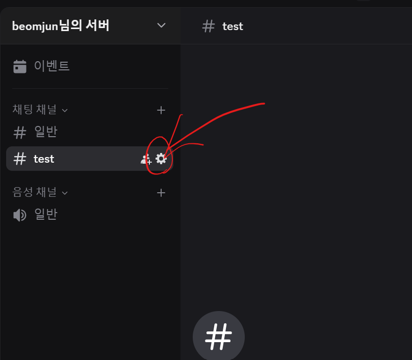

# Google Apps Script Library
## Table of Contents

- [Add Library by ID](#add-library-by-id)
- [Features](#features)
  - [1. Send Message by Discord Webhook](#1-send-message-by-discord-web-hook)
  - [2. Edit Message in Google Docs](#2-edit-message-by-google-docs)

## add library by id
```
1DACK8esZyNHKxl23yYrX4V08mGytETjBXQ2j_SEe_PZmqjsIzFTcvuLr
```


## 1. send message by discord web hook
```javascript
    const dico = new GAS_UTILS.DiscordNotifier('discord web hook address')
    dico.sendText('message')

```



## 2. edit message by google docs

- Clear all content and Add text in Google Docs.

```javascript
    const docs = new GAS_UTILS.GoogleDocs('google docs id')
    docs.clearAddText("TEXT")
```


- Add text to the end of Google Docs while keeping existing content.

```javascript
    const docs = GAS_UTILS.GoogleDocs('google docs id')
    docs.addText("TEXT")
```


